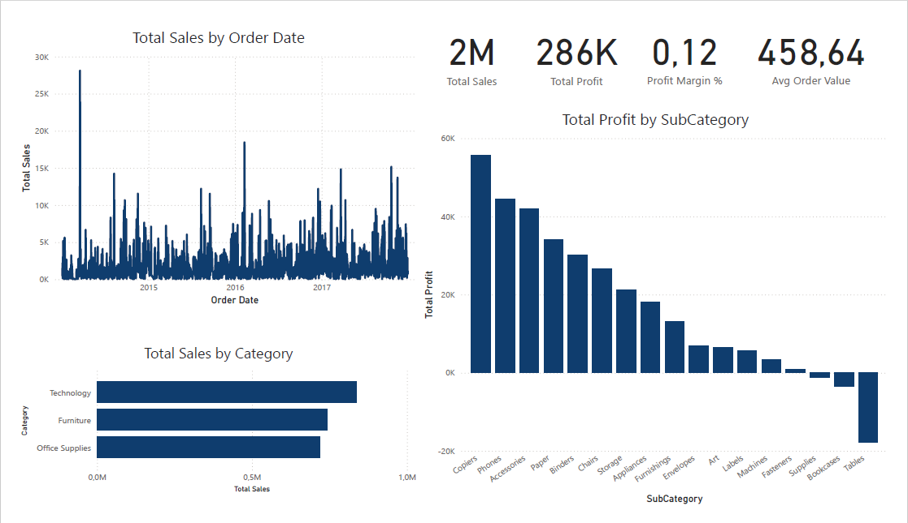
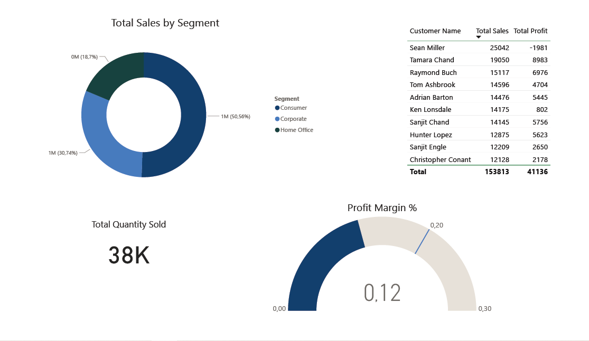
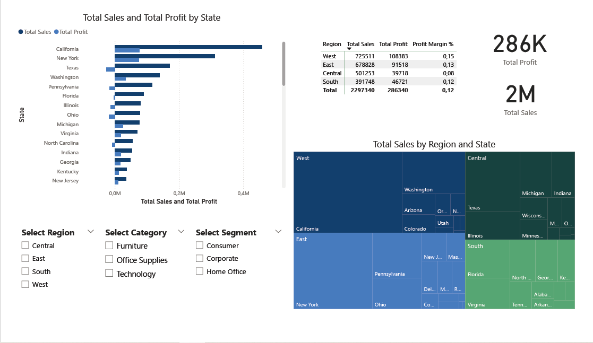

# Sales & Customer Insights Dashboard (Power BI)

This project is an interactive 3-page Power BI dashboard built using the Superstore dataset.  
It provides executive-level insights into sales performance, customer behavior, and regional analysis.

---

## Features
- **Sales Overview**: KPIs (Sales, Profit, Profit Margin %, Avg Order Value), sales trend over time, category and sub-category analysis.
- **Customer Insights**: Sales segmentation by customer type, top 10 customers table, profitability gauge, total quantity sold.
- **Regional Analysis**: KPIs by region, treemap of sales by region and state, clustered bar chart for sales & profit, interactive slicers (Region, Category, Segment).

---

## Tools & Skills Demonstrated
- **Power BI Desktop**: Data modeling, DAX measures, report building
- **DAX**: Custom measures for KPIs (e.g., Total Sales, Profit Margin %)
- **Visualization**: KPI cards, line/bar charts, treemap, slicers, conditional formatting

---

## Files
- `Superstore_Dashboard.pbix` → Power BI file
- `Superstore_Dashboard.pdf` → Exported report
- `screenshots/` → Images of dashboard pages

---

## Screenshots
### Page 1 – Sales Overview
  

### Page 2 – Customer Insights

### Page 3 – Regional Analysis

---

## Insights
- Sales and profits are highest in the Technology category
- West region outperforms others in revenue
- A small % of customers drive most of the revenue
- Profit margins vary strongly by sub-category (some products are loss-making)

---

## 👤 Author
Created by [Eleni] | [LinkedIn Profile](https://www.linkedin.com/in/eleniandreikou/)